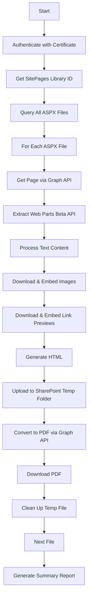

# SharePoint ASPX to PDF Converter

A PowerShell script that converts SharePoint ASPX pages to PDF using Microsoft Graph API. This tool is designed for enterprise environments and can be deployed as an Azure Function App for automated, browser-independent PDF generation.

## Features

- **🔐 Certificate-Based Authentication**: Secure, non-interactive authentication using Azure AD app certificates
- **📄 Complete Content Extraction**: Captures text, images, and link preview cards from SharePoint pages
- **🖼️ Base64 Image Embedding**: Downloads and embeds all images directly in the PDF for proper rendering
- **🔄 Intelligent Retry Logic**: Built-in throttling detection with exponential backoff and Retry-After header support
- **📊 Comprehensive Logging**: Dual-format logging (text log + CSV report) with detailed metrics
- **☁️ Function App Ready**: No browser dependency - designed for serverless deployment
- **🎯 Direct Library Access**: Bypasses search API limitations for reliable page enumeration

## Prerequisites

### Azure AD Application Setup

1. **Register an Azure AD Application**:
   - Navigate to Azure Portal → Azure Active Directory → App registrations
   - Click "New registration"
   - Provide a name (e.g., "ASPX PDF Converter")
   - Register the application

2. **Configure API Permissions**:
   - Go to "API permissions" in your app registration
   - Add the following Microsoft Graph **Application permissions**:
     - `Sites.Read.All` - Read items in all site collections
     - `Files.Read.All` - Read files in all site collections
   - Click "Grant admin consent"

3. **Upload Certificate**:
   - Generate a self-signed certificate or use an existing one:
     ```powershell
     $cert = New-SelfSignedCertificate -Subject "CN=ASPXConverter" -CertStoreLocation "Cert:\LocalMachine\My" -KeyExportPolicy Exportable -KeySpec Signature -KeyLength 2048 -KeyAlgorithm RSA -HashAlgorithm SHA256
     ```
   - Export the public key (.cer file):
     ```powershell
     Export-Certificate -Cert $cert -FilePath "C:\Temp\ASPXConverter.cer"
     ```
   - In Azure AD app registration, go to "Certificates & secrets" → "Certificates" → "Upload certificate"
   - Upload the .cer file

4. **Note Application Details**:
   - Copy the **Application (client) ID**
   - Copy your Azure AD **Tenant ID**
   - Copy the certificate **Thumbprint**

### Local Environment

- **PowerShell 5.1 or later** (PowerShell 7+ recommended)
- **Certificate installed** in LocalMachine\My or CurrentUser\My certificate store
- **Network access** to Microsoft Graph API endpoints

## Installation

1. **Clone or download the script**:
   ```powershell
   # Download to your working directory
   Invoke-WebRequest -Uri "https://raw.githubusercontent.com/your-repo/convert-aspx-to-pdf.ps1" -OutFile "convert-aspx-to-pdf.ps1"
   ```

2. **Configure the script**:
   Open `convert-aspx-to-pdf.ps1` and update the Configuration section (lines 40-51):
   ```powershell
   $tenantId = 'your-tenant-id-here'
   $clientId = 'your-client-id-here'
   $Thumbprint = "your-certificate-thumbprint-here"
   $CertStore = 'LocalMachine'  # or 'CurrentUser'
   $siteUrl = "https://yourtenant.sharepoint.com/sites/YourSite"
   $outputFolder = $env:TEMP
   $logFolder = Join-Path -Path $env:TEMP -ChildPath "ASPX_Conversion_Logs"
   ```

3. **Verify certificate installation**:
   ```powershell
   Get-ChildItem Cert:\LocalMachine\My | Where-Object { $_.Thumbprint -eq "YOUR_THUMBPRINT" }
   ```

## Usage

### Basic Execution

```powershell
# Navigate to the script directory
cd "C:\Path\To\Script"

# Execute the script
.\convert-aspx-to-pdf.ps1
```

### Output

The script creates two output locations:

1. **Converted PDFs**: `%TEMP%\ConvertedASPX_YYYYMMDDHHMMSS\`
   - Contains PDF and intermediate HTML files
   - Timestamped folder for each execution

2. **Logs**: `%TEMP%\ASPX_Conversion_Logs\`
   - `conversion_log_YYYYMMDDHHMMSS.log` - Detailed text log
   - `conversion_summary_YYYYMMDDHHMMSS.csv` - Structured data with metrics

### Example Output

```
[2025-11-21 16:43:17] [INFO] ASPX to PDF Conversion - Starting
[2025-11-21 16:43:17] [SUCCESS] Certificate found in LocalMachine\My store
[2025-11-21 16:43:17] [SUCCESS] Successfully connected using Certificate authentication
[2025-11-21 16:43:17] [INFO] Found 8 items in SitePages
[2025-11-21 16:43:20] [SUCCESS] Successfully converted Home.aspx to PDF

====== CONVERSION SUMMARY ======
ASPX files found: 8
Files successfully converted: 8
Files failed: 0
================================
```

## How It Works

### Authentication Flow

1. **Certificate Loading**: Retrieves certificate from Windows certificate store
2. **JWT Generation**: Creates and signs a JWT assertion using RS256 algorithm
3. **Token Request**: Exchanges JWT for Microsoft Graph access token
4. **API Calls**: Uses bearer token for all subsequent Graph API requests

### Conversion Process



### Content Extraction

1. **Text Web Parts**: Extracts `innerHtml` from text web parts
2. **Image Web Parts**: Downloads images via Graph API and embeds as base64 data URIs
3. **Link Web Parts**: Downloads preview images and creates styled preview cards
4. **Page ID Handling**: Detects and handles multi-GUID page IDs (arrays vs strings)

### Throttling Handling

The script implements Microsoft's recommended retry patterns:

- **429 (Throttled)**: Respects `Retry-After` header or uses exponential backoff
- **5xx (Server Error)**: Exponential backoff: 1s → 2s → 4s → 8s → 16s
- **Max Retries**: 5 attempts before failure
- **Backoff Formula**: `2^retryCount × baseDelay`

## Logging & Metrics

### Text Log Format

```
[YYYY-MM-DD HH:MM:SS] [LEVEL] Message
```

**Levels**: INFO (Cyan), WARNING (Yellow), ERROR (Red), SUCCESS (Green)

### CSV Report Columns

| Column | Description |
|--------|-------------|
| Timestamp | When the conversion was attempted |
| FileName | Name of the ASPX file |
| WebUrl | Full SharePoint URL to the page |
| Status | Success or Failed |
| OutputPath | Local path to the generated PDF |
| ErrorMessage | Error details if failed |
| WebPartsProcessed | Number of web parts found |
| ImagesEmbedded | Number of images embedded |
| LinksProcessed | Number of link cards created |
| ProcessingTime | Duration in seconds |
| StartTime | Conversion start timestamp |
| EndTime | Conversion end timestamp |

## Troubleshooting

### Common Issues

#### 1. Certificate Not Found
```
ERROR: Certificate not found at Cert:\LocalMachine\My\THUMBPRINT
```
**Solution**: 
- Verify certificate thumbprint is correct
- Check certificate store location (LocalMachine vs CurrentUser)
- Ensure certificate has private key

#### 2. 400 Bad Request - Page ID Issue
```
ERROR: Beta API failed: Response status code does not indicate success: 400 (Bad Request)
```
**Solution**: 
- This is handled automatically - script detects array page IDs
- Verify you're using the latest version of the script

#### 3. 401 Unauthorized
```
ERROR: Response status code does not indicate success: 401 (Unauthorized)
```
**Solution**:
- Verify API permissions are granted and admin consented
- Check token expiration (tokens are valid for 60 minutes)
- Confirm certificate is valid and not expired

#### 4. 403 Forbidden
```
ERROR: Response status code does not indicate success: 403 (Forbidden)
```
**Solution**:
- Verify `Sites.Read.All` and `Files.Read.All` permissions are granted
- Ensure admin consent was completed
- Check that app registration is active

#### 5. 429 Throttled
```
WARNING: Throttled (429). Retry-After: 30 seconds
```
**Solution**: 
- Script handles this automatically with retry logic
- For large environments, consider adding delays between conversions

#### 6. Empty PDF or Missing Images
```
WARNING: Could not download image via Graph API
```
**Solution**:
- Check image permissions in SharePoint
- Verify unique ID format in download URL
- Review intermediate HTML file for debugging

### Debug Mode

Enable verbose logging by checking the log file:
```powershell
Get-Content "$env:TEMP\ASPX_Conversion_Logs\conversion_log_*.log" -Tail 50
```

View failed conversions:
```powershell
Import-Csv "$env:TEMP\ASPX_Conversion_Logs\conversion_summary_*.csv" | 
    Where-Object { $_.Status -eq "Failed" } | 
    Format-Table FileName, ErrorMessage
```

## Deployment to Azure Function App

### 1. Create Function App

```powershell
# Create resource group
az group create --name rg-aspx-converter --location eastus

# Create storage account
az storage account create --name staspxconverter --resource-group rg-aspx-converter --location eastus --sku Standard_LRS

# Create Function App
az functionapp create --resource-group rg-aspx-converter --consumption-plan-location eastus --runtime powershell --runtime-version 7.2 --functions-version 4 --name func-aspx-converter --storage-account staspxconverter
```

### 2. Configure Certificate

```powershell
# Upload certificate to Function App
az functionapp config ssl upload --certificate-file "C:\Temp\ASPXConverter.pfx" --certificate-password "YourPassword" --name func-aspx-converter --resource-group rg-aspx-converter

# Set certificate thumbprint in app settings
az functionapp config appsettings set --name func-aspx-converter --resource-group rg-aspx-converter --settings WEBSITE_LOAD_CERTIFICATES=*
```

### 3. Deploy Script

1. Create `function.json`:
   ```json
   {
     "bindings": [
       {
         "name": "Timer",
         "type": "timerTrigger",
         "direction": "in",
         "schedule": "0 0 2 * * *"
       }
     ]
   }
   ```

2. Create `run.ps1` (use the main script content)

3. Deploy via VS Code Azure Functions extension or Azure CLI

### 4. Configure Timer Trigger

Edit the `schedule` in `function.json` using CRON format:
- `0 0 2 * * *` - Daily at 2:00 AM
- `0 */6 * * *` - Every 6 hours
- `0 0 * * 1` - Weekly on Monday

## Performance Considerations

### Large Environments

For sites with 100+ ASPX pages:

1. **Batch Processing**: Modify script to process in batches
2. **Parallel Execution**: Use PowerShell jobs for concurrent conversions
3. **Filter Pages**: Add date range filters to process only recent pages
4. **Increase Delays**: Add `Start-Sleep` between conversions to avoid throttling

### Optimization Tips

```powershell
# Process only pages modified in last 30 days
$cutoffDate = (Get-Date).AddDays(-30)
$items = $itemsResponse.value | Where-Object { 
    [DateTime]$_.fields.Modified -gt $cutoffDate 
}
```

## Current Limitations

- **Web Parts Support**: Limited to text, image, and link web parts
- **Authentication**: Requires certificate-based authentication (no interactive login)
- **SharePoint Online**: Optimized for SharePoint Online (not on-premises)
- **File Size**: Large pages (>10MB HTML) may timeout during PDF conversion

## Security Best Practices

1. **Certificate Storage**: Store certificates securely in Azure Key Vault for production
2. **Least Privilege**: Request only required API permissions
3. **Certificate Rotation**: Implement certificate renewal process (typically yearly)
4. **Audit Logging**: Review CSV logs regularly for security monitoring
5. **Secret Management**: Never commit certificates or credentials to source control

## Contributing

Contributions are welcome! Please:

1. Fork the repository
2. Create a feature branch (`git checkout -b feature/improvement`)
3. Commit changes (`git commit -am 'Add new feature'`)
4. Push to branch (`git push origin feature/improvement`)
5. Create a Pull Request

## License

This project is licensed under the MIT License - see the LICENSE file for details.

## Author

**Mike Lee**  
Date: November 21, 2025

## Changelog

### Version 1.0 (2025-11-21)
- Initial release
- Certificate-based authentication
- Complete content extraction (text, images, links)
- Base64 image embedding
- Intelligent retry logic with throttling detection
- Comprehensive logging (text + CSV)
- Browser-independent PDF conversion
- Array page ID handling for multi-GUID scenarios

## Support

For issues, questions, or feature requests:
- Open an issue on GitHub
- Review existing issues for solutions
- Check troubleshooting section above

## Acknowledgments

- Microsoft Graph API team for comprehensive documentation
- SharePoint community for ASPX page structure insights
- PowerShell community for best practices and patterns
